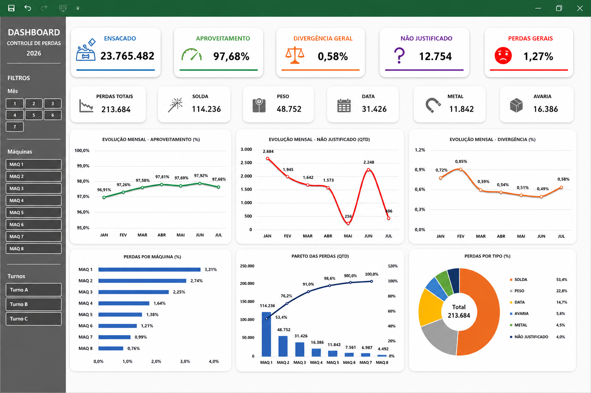

# 📊 Factory Dashboard Generator

<p align="center">
  
</p>

---

## 📌 About

Factory Dashboard Generator is an industrial data analysis project developed using Microsoft Excel and Power Query.

The project was created to transform production data into interactive dashboards, allowing better visualization of operational performance, losses and key indicators.

---

## 🎯 Objective

The main objective is to simplify the analysis process by automating data preparation and creating a centralized view of important production metrics.

---

## 🚧 Problem

Production information often requires manual consolidation from different sources, making analysis slower and increasing the possibility of errors.

The challenge was to create a solution capable of organizing data and providing faster access to reliable information.

---

## 💡 Solution

An interactive dashboard was developed using Excel and Power Query to automate data transformation, consolidate information and generate visual insights.

The solution includes:

- Automatic data consolidation
- KPI monitoring
- Production performance analysis
- Loss indicators
- Machine performance visualization
- Interactive filters

---

## 📈 Result

The dashboard provides a clearer overview of operational performance, helping users identify trends, monitor indicators and support data-driven decisions.

---

## ✨ Features

- Interactive dashboard
- Production performance analysis
- KPI monitoring
- Loss indicators
- Machine performance visualization
- Data consolidation with Power Query

## 🛠 Technologies

<div align="center">


</div>

---

## 📂 Project Structure

```text
Factory-Dashboard-Generator
│
├── Images
│   └── dashboard-preview.png
│
├── Documentation
│
└── README.md
```
